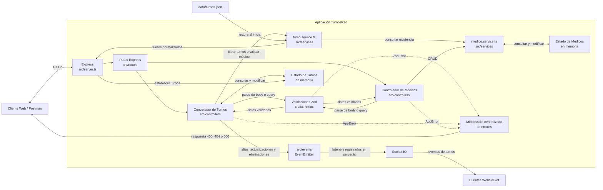
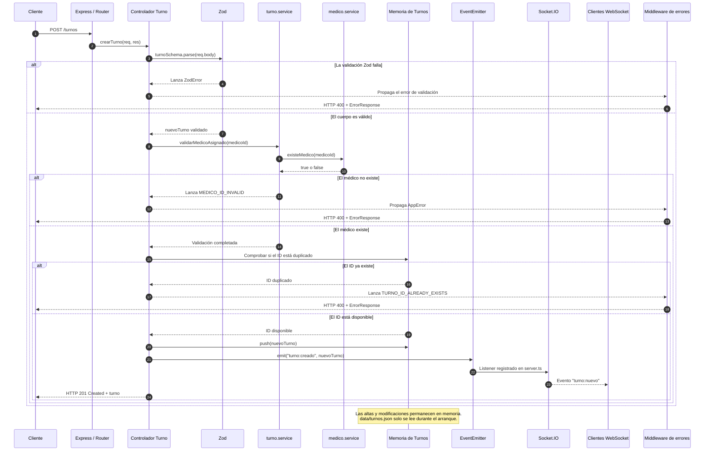

# TurnosRed

TurnosRed es una API REST académica desarrollada con Node.js, TypeScript y Express para administrar turnos médicos y profesionales de salud. El proyecto aplica una arquitectura por capas, validación con Zod, manejo centralizado de errores, filtros mediante query parameters y notificaciones en tiempo real con EventEmitter y Socket.IO.

Los turnos iniciales se cargan desde un archivo JSON. Durante la ejecución, tanto los turnos como los médicos se administran en memoria, por lo que las modificaciones realizadas mediante la API no persisten después de reiniciar el servidor.

## Requisitos previos

- Node.js LTS `24.20.0`, versión definida en `.nvmrc`.
- npm para instalar dependencias y ejecutar los scripts.
- Git para clonar y versionar el proyecto.
- Postman para importar la colección, ejecutar sus pruebas y trabajar con los ejemplos del Mock Server.

## Instalación y ejecución

1. Clonar el repositorio y entrar en su directorio:

   ```bash
   git clone <URL_DEL_REPOSITORIO>
   cd turnos-red
   ```

2. Instalar las dependencias locales declaradas en `package.json`:

   ```bash
   npm install
   ```

3. Crear `.env` a partir de `.env.example` y ajustar sus valores si corresponde.

4. Compilar TypeScript en `dist/`:

   ```bash
   npm run build
   ```

5. Iniciar el servidor compilado:

   ```bash
   npm start
   ```

Con la configuración de ejemplo, la API y la página estática quedan disponibles en `http://localhost:3000`.

Antes de integrar cambios se recomienda ejecutar el análisis estático:

```bash
npm run lint
```

Para aplicar el formato configurado por Prettier a los archivos TypeScript de `src/`:

```bash
npm run format
```

### Scripts npm

| Script           | Comando interno                  | Uso                                                                              |
| ---------------- | -------------------------------- | -------------------------------------------------------------------------------- |
| `npm run build`  | `tsc`                            | Compila `src/` y genera JavaScript y source maps en `dist/`.                     |
| `npm start`      | `node dist/server.js`            | Inicia la aplicación compilada; requiere ejecutar antes `npm run build`.         |
| `npm run dev`    | `node --watch dist/server.js`    | Observa el servidor compilado. No compila automáticamente los cambios de `src/`. |
| `npm run lint`   | `eslint . --ext .ts`             | Comprueba las reglas de ESLint para TypeScript.                                  |
| `npm run format` | `prettier --write "src/**/*.ts"` | Formatea los archivos TypeScript dentro de `src/`.                               |

## Variables de entorno

Las variables públicas de configuración se encuentran en `.env.example`:

| Variable    | Valor de ejemplo     | Descripción                                                   |
| ----------- | -------------------- | ------------------------------------------------------------- |
| `PORT`      | `3000`               | Puerto en el que escucha el servidor HTTP.                    |
| `DATA_PATH` | `./data/turnos.json` | Ruta del archivo JSON usado para cargar los turnos iniciales. |

Si no se definen, el servidor utiliza los valores de ejemplo como valores predeterminados. El archivo `.env` local no debe publicarse.

## Estructura del proyecto

```text
turnos-red/
├── data/
│   └── turnos.json
├── public/
│   └── index.html
├── src/
│   ├── controllers/
│   │   ├── medico.controller.ts
│   │   └── turno.controller.ts
│   ├── errors/
│   │   └── app.error.ts
│   ├── events/
│   │   └── turno.events.ts
│   ├── middlewares/
│   │   └── error.middleware.ts
│   ├── models/
│   │   ├── medico.model.ts
│   │   └── turno.model.ts
│   ├── routes/
│   │   ├── medico.routes.ts
│   │   └── turno.routes.ts
│   ├── schemas/
│   │   ├── especialidad.schema.ts
│   │   ├── medico.schema.ts
│   │   └── turno.schema.ts
│   ├── services/
│   │   ├── medico.service.ts
│   │   └── turno.service.ts
│   ├── utils/
│   │   ├── ejemploCallback.ts
│   │   └── normalizarTurno.ts
│   └── server.ts
├── .env.example
├── .nvmrc
├── .prettierrc.json
├── eslint.config.js
├── package-lock.json
├── package.json
├── tsconfig.json
└── turnos-red.postman_collection.json
```

- `controllers/`: recibe las solicitudes HTTP y delega la lógica correspondiente.
- `errors/`: define `AppError`, utilizado para errores esperados de la aplicación.
- `events/`: contiene el bus interno basado en EventEmitter.
- `middlewares/`: centraliza las respuestas de error HTTP.
- `models/`: declara las interfaces de dominio de Turno y Médico.
- `routes/`: vincula cada endpoint con su controlador.
- `schemas/`: contiene los schemas Zod de cuerpos y query parameters.
- `services/`: concentra la carga inicial, el CRUD de médicos y la lógica de filtrado.
- `utils/`: contiene la normalización de los turnos históricos y el ejemplo de callbacks.
- `server.ts`: configura Express, las rutas, los middlewares, el servidor HTTP y Socket.IO.
- `dist/`: se genera con `npm run build` y no debe editarse manualmente.

## Arquitectura

### Diagrama de componentes

El siguiente diagrama representa los componentes que existen actualmente y sus comunicaciones principales. Los turnos históricos se leen desde `data/turnos.json` durante el arranque; después de esa carga, los turnos y los médicos se administran exclusivamente en memoria.



No existe una capa de repositorios ni una base de datos. Tampoco existe `medicos.json`: los médicos iniciales están definidos en `medico.service.ts` y el servicio gestiona su arreglo en memoria. Las operaciones POST, PUT y DELETE de turnos modifican el estado en memoria, pero no escriben `data/turnos.json`.

### Secuencia de POST /turnos

El flujo de creación valida el cuerpo y la referencia al médico antes de modificar el arreglo de turnos. EventEmitter ejecuta sus listeners de forma síncrona, por lo que Socket.IO retransmite el evento antes de que el controlador envíe la respuesta HTTP 201.



## Especialidades válidas

Turnos y médicos aceptan exactamente estas especialidades:

- `Clínica médica`
- `Pediatría`
- `Odontología`
- `Nutrición`

## API de Turnos

### Modelo Turno

| Campo           | Tipo      | Obligatorio | Descripción                                                                         |
| --------------- | --------- | ----------- | ----------------------------------------------------------------------------------- |
| `id`            | `number`  | Sí          | Entero positivo que identifica el turno.                                            |
| `paciente`      | `string`  | Sí          | Nombre del paciente; no puede quedar vacío después de aplicar `trim`.               |
| `documento`     | `string`  | Sí          | Documento del paciente. Debe enviarse como texto, incluso si solo contiene dígitos. |
| `especialidad`  | `string`  | Sí          | Una de las especialidades válidas.                                                  |
| `fecha`         | `string`  | Sí          | Fecha válida en formato `YYYY-MM-DD`.                                               |
| `hora`          | `string`  | Sí          | Hora válida en formato `HH:mm`.                                                     |
| `confirmado`    | `boolean` | Sí          | Indica si el turno está confirmado.                                                 |
| `medicoId`      | `number`  | Sí          | Entero positivo correspondiente a un médico existente.                              |
| `observaciones` | `string`  | No          | Información adicional del turno.                                                    |

Los registros históricos sin `medicoId` se normalizan durante la carga inicial y reciben el médico asociado a su especialidad. Este proceso no modifica manualmente `data/turnos.json`.

### Endpoints de Turnos

| Método   | Ruta          | Finalidad                                    | Códigos principales | Cuerpo esperado                                                                          |
| -------- | ------------- | -------------------------------------------- | ------------------- | ---------------------------------------------------------------------------------------- |
| `GET`    | `/turnos`     | Listar todos los turnos o aplicar filtros.   | `200`, `400`        | No corresponde.                                                                          |
| `GET`    | `/turnos/:id` | Obtener un turno por ID.                     | `200`, `400`, `404` | No corresponde.                                                                          |
| `POST`   | `/turnos`     | Crear un turno.                              | `201`, `400`        | Modelo Turno completo.                                                                   |
| `PUT`    | `/turnos/:id` | Reemplazar completamente un turno existente. | `200`, `400`, `404` | Todos los campos salvo que `id` puede omitirse; si se envía, debe coincidir con la ruta. |
| `DELETE` | `/turnos/:id` | Eliminar un turno.                           | `204`, `400`, `404` | No corresponde; el éxito no devuelve cuerpo.                                             |

Ejemplo de cuerpo válido para POST:

```json
{
  "id": 201,
  "paciente": "María Pérez",
  "documento": "30111222",
  "especialidad": "Pediatría",
  "fecha": "2026-08-14",
  "hora": "10:30",
  "confirmado": true,
  "medicoId": 2,
  "observaciones": "Control anual"
}
```

## API de Médicos

### Modelo Médico

| Campo          | Tipo      | Obligatorio | Descripción                                                              |
| -------------- | --------- | ----------- | ------------------------------------------------------------------------ |
| `id`           | `number`  | Sí          | Entero positivo que identifica al médico.                                |
| `nombre`       | `string`  | Sí          | Nombre del profesional; no puede quedar vacío después de aplicar `trim`. |
| `especialidad` | `string`  | Sí          | Una de las especialidades válidas.                                       |
| `disponible`   | `boolean` | Sí          | Indica si el médico está disponible.                                     |

Los médicos se almacenan en memoria y se inicializan con profesionales de ejemplo.

### Endpoints de Médicos

| Método   | Ruta           | Finalidad                                     | Códigos principales | Cuerpo esperado                                                                          |
| -------- | -------------- | --------------------------------------------- | ------------------- | ---------------------------------------------------------------------------------------- |
| `GET`    | `/medicos`     | Listar todos los médicos o aplicar filtros.   | `200`, `400`        | No corresponde.                                                                          |
| `GET`    | `/medicos/:id` | Obtener un médico por ID.                     | `200`, `400`, `404` | No corresponde.                                                                          |
| `POST`   | `/medicos`     | Crear un médico.                              | `201`, `400`        | Modelo Médico completo.                                                                  |
| `PUT`    | `/medicos/:id` | Reemplazar completamente un médico existente. | `200`, `400`, `404` | Todos los campos salvo que `id` puede omitirse; si se envía, debe coincidir con la ruta. |
| `DELETE` | `/medicos/:id` | Eliminar un médico.                           | `204`, `400`, `404` | No corresponde; el éxito no devuelve cuerpo.                                             |

Ejemplo de cuerpo válido para POST:

```json
{
  "id": 5,
  "nombre": "Laura Fernández",
  "especialidad": "Nutrición",
  "disponible": true
}
```

## Query Parameters

No se crean endpoints adicionales para filtrar. Los filtros se envían sobre las rutas de colección y pueden combinarse.

### Filtros de Turnos

| Parámetro      | Validación                 | Ejemplo                              |
| -------------- | -------------------------- | ------------------------------------ |
| `especialidad` | Una especialidad válida.   | `GET /turnos?especialidad=Pediatría` |
| `fecha`        | Fecha válida `YYYY-MM-DD`. | `GET /turnos?fecha=2026-08-14`       |
| `medicoId`     | Entero positivo.           | `GET /turnos?medicoId=2`             |

Ejemplo combinado:

```http
GET /turnos?especialidad=Pediatría&medicoId=2
```

### Filtros de Médicos

| Parámetro      | Validación                   | Ejemplo                                 |
| -------------- | ---------------------------- | --------------------------------------- |
| `especialidad` | Una especialidad válida.     | `GET /medicos?especialidad=Odontología` |
| `disponible`   | Únicamente `true` o `false`. | `GET /medicos?disponible=true`          |

Ejemplo para médicos no disponibles:

```http
GET /medicos?disponible=false
```

Una consulta válida sin coincidencias responde `200 OK` con un arreglo vacío (`[]`). Un valor de filtro inválido responde `400 Bad Request` con el formato estándar de errores.

## Validación con Zod

Los cuerpos de POST y PUT, junto con los query parameters, se validan mediante Zod antes de ejecutar la operación solicitada.

- Turno y Médico usan objetos estrictos; los campos desconocidos se rechazan.
- `documento` debe ser un `string`.
- `fecha` debe ser una fecha real en formato `YYYY-MM-DD`.
- `hora` debe usar el formato `HH:mm` y representar una hora válida.
- Las especialidades deben coincidir exactamente con los valores admitidos.
- `medicoId` debe ser un entero positivo y, al crear o actualizar un turno, corresponder a un médico existente.
- Un error de validación devuelve HTTP `400` y `details` identifica los campos o parámetros que fallaron.

## Manejo de errores

Los errores esperados se representan mediante `AppError` y todos llegan al middleware centralizado. Los errores inesperados se transforman en HTTP `500` con el código `INTERNAL_SERVER_ERROR`.

Toda respuesta de error conserva las propiedades `status`, `message`, `code` y `details`:

```json
{
  "status": 400,
  "message": "Error de validación en los datos ingresados",
  "code": "VALIDATION_ERROR",
  "details": [
    {
      "field": "documento",
      "message": "El documento debe ser un texto"
    }
  ]
}
```

Códigos de error utilizados:

- `INVALID_ID`
- `VALIDATION_ERROR`
- `TURNO_NOT_FOUND`
- `TURNO_ID_ALREADY_EXISTS`
- `MEDICO_NOT_FOUND`
- `MEDICO_ID_ALREADY_EXISTS`
- `MEDICO_ID_INVALID`
- `ROUTE_NOT_FOUND`
- `INTERNAL_SERVER_ERROR`

## EventEmitter y Socket.IO

Las operaciones exitosas sobre turnos emiten estos eventos internos mediante EventEmitter:

| Operación        | Evento interno      | Evento retransmitido por Socket.IO |
| ---------------- | ------------------- | ---------------------------------- |
| Crear turno      | `turno:creado`      | `turno:nuevo`                      |
| Actualizar turno | `turno:actualizado` | `turno:actualizado`                |
| Eliminar turno   | `turno:eliminado`   | `turno:eliminado`                  |

La página `public/index.html` se conecta al servidor mediante Socket.IO y escucha los tres eventos retransmitidos. De esta manera puede mostrar altas, actualizaciones y eliminaciones sin recargar la página ni realizar consultas periódicas.

## Colección de Postman

El repositorio incluye `turnos-red.postman_collection.json`, una colección importable compatible con Postman Collection v2.1 y organizada en las carpetas Turnos, Médicos, Validaciones y errores, y Query Params.

La colección fue preparada para ejecutar en Postman:

- CRUD de Turnos.
- CRUD de Médicos.
- Filtros mediante query parameters.
- Casos de error HTTP `400` y `404`.
- Scripts de Tests para códigos HTTP, JSON, propiedades, arreglos y filtros.
- Variables de colección e IDs dinámicos para los recursos creados.
- Saved Responses con ejemplos representativos.
- Ejemplos utilizables al configurar un Mock Server.

Antes de ejecutar la colección, debe iniciarse la API y verificarse que la variable `baseUrl` apunte a `http://localhost:3000`. Los ciclos que actualizan y eliminan recursos creados deben ejecutarse en el orden POST, PUT y DELETE.

## Uso de Inteligencia Artificial

| Tarea                              | Herramienta     | Prompt                                                                                                                   | Respuesta generada                                                                                                 | Ajuste manual aplicado                                                             |
| ---------------------------------- | --------------- | ------------------------------------------------------------------------------------------------------------------------ | ------------------------------------------------------------------------------------------------------------------ | ---------------------------------------------------------------------------------- |
| Inspección inicial del proyecto    | Codex           | Inspeccionar estructura, configuración, Turnos, persistencia, errores, eventos, sockets y README sin modificar archivos. | Estado del proyecto, riesgos y archivos previsiblemente afectados.                                                 | Revisión del informe antes de autorizar las modificaciones.                        |
| Middleware centralizado y AppError | Codex           | Refactorizar códigos HTTP y centralizar todas las respuestas de error con un contrato uniforme.                          | Clase `AppError`, middleware de errores, validación de IDs y respuestas `200`, `201`, `204`, `400`, `404` y `500`. | Comprobación manual de respuestas exitosas y errores `400`/`404`.                  |
| CRUD del recurso Médico            | Codex           | Crear modelo, servicio, controlador y rutas CRUD de médicos con almacenamiento en memoria.                               | Recurso Médico por capas con cinco endpoints y datos iniciales coherentes.                                         | Pruebas manuales del CRUD en Postman.                                              |
| Schemas y validaciones con Zod     | Codex           | Incorporar schemas robustos para Turno y Médico e integrar sus errores con el middleware.                                | Schemas estrictos, especialidades compartidas y `details` simplificado por campo.                                  | Verificación manual de cuerpos válidos e inválidos, incluido `documento` numérico. |
| Query parameters y `medicoId`      | Codex           | Añadir filtros combinables y asociar cada turno con un médico existente.                                                 | Filtros en servicios, schemas de query y compatibilidad de `medicoId` para turnos históricos.                      | Comprobación manual de filtros válidos, inválidos y resultados vacíos.             |
| Colección y tests de Postman       | Codex y Postman | Preparar una colección v2.1 con CRUD, filtros, errores y scripts de Tests.                                               | Colección con 24 requests, variables dinámicas y comprobaciones automatizadas.                                     | Ejecución y revisión manual mediante Collection Runner en Postman.                 |
| Saved Responses / Mock Server      | Codex y Postman | Incluir ejemplos representativos para facilitar un Mock Server.                                                          | Saved Responses para respuestas `200`, `201`, `204`, `400` y `404`.                                                | Creación y comprobación manual del Mock Server en Postman.                         |
| Actualización del README           | Codex           | Documentar el estado final de la API, instalación, modelos, endpoints, filtros, errores, tiempo real, Postman e IA.      | README consolidado y actualizado con la implementación actual de TurnosRed.                                        | Ninguno al momento de esta actualización.                                          |
| Configuración Swagger/OpenAPI      | Codex           | Integrar OpenAPI 3.0 con Swagger UI sin modificar el comportamiento existente ni agregar autenticación.                 | Configuración OpenAPI 3.0.3 y documentación interactiva disponible en `/api-docs`.                                 | Compilación, validación estructural y comprobación HTTP de Swagger UI.              |
| Anotaciones JSDoc de la API        | Codex           | Documentar las diez operaciones reales, sus parámetros y los códigos HTTP efectivamente utilizados.                     | Anotaciones próximas a las rutas Express para Turnos y Médicos.                                                    | Comparación manual con rutas, controladores y schemas Zod.                          |
| Schemas OpenAPI                    | Codex           | Definir Turno, Médico, errores y cuerpos de actualización de acuerdo con las validaciones actuales.                      | Schemas reutilizables con tipos, campos obligatorios, formatos y especialidades válidas.                           | Revisión cruzada de obligatoriedad, `documento`, `medicoId`, fechas, horas y enums. |
| Diagramas Mermaid                  | Codex           | Documentar la arquitectura real y la secuencia de `POST /turnos` sin inventar persistencia ni capas inexistentes.        | Diagramas de componentes y secuencia integrados en el README.                                                      | Comprobación factual contra servidor, controladores, servicios, eventos y memoria.  |
| Registros ADR                      | Codex           | Registrar la adopción de OpenAPI y analizar JWT únicamente como propuesta futura.                                       | ADR-001 Aceptado y ADR-002 Propuesto con contexto, consecuencias, alternativas, limitaciones e impacto.            | Revisión manual de estados, fecha y ausencia de implementación de JWT.              |
| Verificación de coherencia         | Codex           | Comparar código, Zod, OpenAPI, Postman, Mermaid y ADR, corrigiendo solo divergencias documentales demostradas.           | Matriz de coherencia, corrección mínima de una respuesta guardada y fuente del informe de evidencias.              | Pruebas HTTP, validación OpenAPI, revisión de Postman y controles de build y lint.   |
