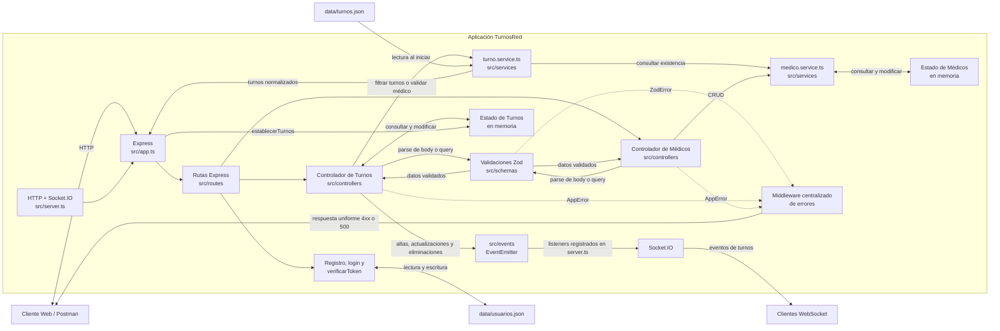
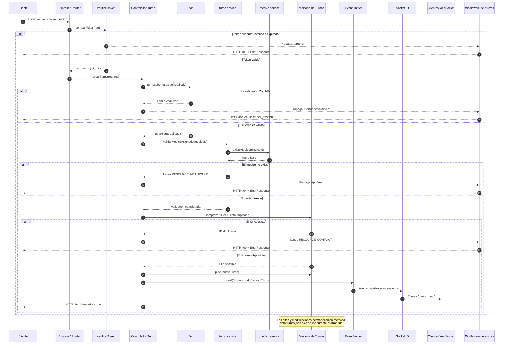

# TurnosRed

TurnosRed es una API REST académica desarrollada con Node.js, TypeScript y Express 4 para administrar turnos médicos y profesionales de salud. El proyecto aplica una arquitectura por capas, validación con Zod, autenticación JWT, manejo centralizado de errores, logging estructurado, pruebas automatizadas, filtros mediante query parameters y notificaciones en tiempo real con EventEmitter y Socket.IO.

Los turnos iniciales se cargan desde un archivo JSON. Durante la ejecución, tanto los turnos como los médicos se administran en memoria, por lo que las modificaciones realizadas mediante la API no persisten después de reiniciar el servidor.

## Requisitos previos

- Node.js LTS `24.20.0`, versión definida en `.nvmrc`.
- npm para instalar dependencias y ejecutar los scripts.
- Git para clonar y versionar el proyecto.
- Postman para importar la colección, ejecutar sus pruebas y trabajar con los ejemplos del Mock Server.
- Nginx para Windows, opcional, para validar el despliegue mediante proxy inverso.

## Instalación y ejecución

1. Clonar el repositorio y entrar en su directorio:

   ```bash
   git clone <URL_DEL_REPOSITORIO>
   cd turnos-red
   ```

2. Instalar las dependencias locales declaradas en `package.json`:

   ```bash
   npm install
   ```

3. Crear `.env` a partir de `.env.example` y ajustar sus valores si corresponde.

4. Compilar TypeScript en `dist/`:

   ```bash
   npm run build
   ```

5. Iniciar el servidor compilado:

   ```bash
   npm start
   ```

Con la configuración de ejemplo, la API y la página estática quedan disponibles en `http://localhost:3000`.

Antes de integrar cambios se recomienda ejecutar el análisis estático:

```bash
npm run lint
```

Para aplicar el formato configurado por Prettier a los archivos TypeScript de `src/`:

```bash
npm run format
```

### Scripts npm

| Script           | Comando interno                  | Uso                                                                              |
| ---------------- | -------------------------------- | -------------------------------------------------------------------------------- |
| `npm run build`  | `tsc`                            | Compila `src/` y genera JavaScript y source maps en `dist/`.                     |
| `npm start`      | `node dist/server.js`            | Inicia la aplicación compilada; requiere ejecutar antes `npm run build`.         |
| `npm run dev`    | `node --watch dist/server.js`    | Observa el servidor compilado. No compila automáticamente los cambios de `src/`. |
| `npm run lint`   | `eslint . --ext .ts`             | Comprueba las reglas de ESLint para TypeScript.                                  |
| `npm test`       | `jest --coverage --runInBand`     | Ejecuta las pruebas automatizadas y genera el reporte de cobertura.              |
| `npm run format` | `prettier --write "src/**/*.ts"` | Formatea los archivos TypeScript dentro de `src/`.                               |

## Variables de entorno

Las variables públicas de configuración se encuentran en `.env.example`:

| Variable          | Valor de ejemplo                    | Descripción                                                                 |
| ----------------- | ----------------------------------- | --------------------------------------------------------------------------- |
| `PORT`            | `3000`                              | Puerto en el que escucha el servidor HTTP.                                  |
| `DATA_PATH`       | `./data/turnos.json`                | Ruta del archivo JSON usado para cargar los turnos iniciales.               |
| `USERS_DATA_PATH` | `./data/usuarios.json`              | Ruta del archivo JSON donde se persisten los usuarios registrados.          |
| `JWT_SECRET`      | `replace-with-a-strong-secret`      | Secreto privado utilizado para firmar y verificar JWT. No posee valor seguro predeterminado. |
| `LOG_LEVEL`       | `info`                              | Nivel de Pino. Si es válido, reemplaza el nivel predeterminado del entorno.  |

`PORT`, `DATA_PATH` y `USERS_DATA_PATH` tienen valores predeterminados equivalentes a los ejemplos. `JWT_SECRET` debe configurarse para utilizar registro, login o rutas protegidas. En desarrollo, Pino usa `info` por defecto; en producción usa `error`, salvo que se indique un `LOG_LEVEL` válido.

El archivo `.env` está ignorado por Git y no debe versionarse. `JWT_SECRET` debe ser fuerte, privado y distinto para cada entorno. Tampoco deben subirse tokens, contraseñas ni otras credenciales al repositorio.

## Autenticación

El flujo de autenticación es:

```text
Registro
   ↓
Login
   ↓
Obtención del JWT
   ↓
Authorization: Bearer <token>
   ↓
Operación protegida
```

### Registro

`POST /auth/registro` recibe un email y una contraseña. El servidor normaliza el email, asigna siempre el rol `usuario` y persiste únicamente el hash generado con `bcryptjs`; nunca almacena ni devuelve la contraseña en texto plano.

```http
POST /auth/registro
Content-Type: application/json

{
  "email": "actividad4@example.com",
  "password": "Password123!"
}
```

Un registro correcto responde `201 Created` con `id`, `email` y `rol`. Un email duplicado responde `409 RESOURCE_CONFLICT`.

### Login y uso del token

`POST /auth/login` compara la contraseña mediante bcrypt y devuelve un JWT firmado con HS256. El token contiene `id` y `rol`, y expira en una hora.

```http
POST /auth/login
Content-Type: application/json

{
  "email": "actividad4@example.com",
  "password": "Password123!"
}
```

La respuesta exitosa tiene la forma `{"token":"<jwt>"}`. El valor recibido se envía en las escrituras protegidas:

```http
Authorization: Bearer <token>
```

Los `GET` de `/turnos` y `/medicos` son públicos. Los métodos `POST`, `PUT` y `DELETE` de ambos recursos requieren un token válido. La ausencia de token responde `401 AUTH_TOKEN_MISSING`; un token inválido o expirado responde `401 AUTH_TOKEN_INVALID`.

## Estructura del proyecto

```text
turnos-red/
├── data/
│   ├── turnos.json
│   └── usuarios.json
├── docs/adr/
│   ├── ADR-001-uso-de-openapi.md
│   ├── ADR-002-adopcion-de-jwt.md
│   ├── ADR-003-uso-de-nginx.md
│   └── ADR-004-persistencia-en-archivos-json.md
├── public/
│   └── index.html
├── src/
│   ├── config/
│   │   ├── env.ts
│   │   ├── logger.ts
│   │   └── swagger.ts
│   ├── controllers/
│   │   ├── auth.controller.ts
│   │   ├── medico.controller.ts
│   │   └── turno.controller.ts
│   ├── errors/
│   │   └── app.error.ts
│   ├── events/
│   │   └── turno.events.ts
│   ├── middlewares/
│   │   ├── async-handler.middleware.ts
│   │   ├── auth.middleware.ts
│   │   └── error.middleware.ts
│   ├── models/
│   │   ├── medico.model.ts
│   │   └── turno.model.ts
│   ├── routes/
│   │   ├── auth.routes.ts
│   │   ├── medico.routes.ts
│   │   └── turno.routes.ts
│   ├── schemas/
│   │   ├── especialidad.schema.ts
│   │   ├── medico.schema.ts
│   │   └── turno.schema.ts
│   ├── services/
│   │   ├── auth.service.ts
│   │   ├── medico.service.ts
│   │   └── turno.service.ts
│   ├── utils/
│   │   ├── ejemploCallback.ts
│   │   └── normalizarTurno.ts
│   ├── app.ts
│   └── server.ts
├── tests/
├── .env.example
├── jest.config.cjs
├── nginx.conf
├── package-lock.json
├── package.json
├── tsconfig.json
└── turnos-red.postman_collection.json
```

- `config/`: centraliza configuración de entorno, Pino y OpenAPI.
- `controllers/`: recibe las solicitudes HTTP y delega la lógica correspondiente.
- `errors/`: define `AppError`, utilizado para errores esperados de la aplicación.
- `events/`: contiene el bus interno basado en EventEmitter.
- `middlewares/`: contiene autenticación, propagación asíncrona y respuestas centralizadas de error.
- `models/`: declara las estructuras de Turno, Médico y Usuario.
- `routes/`: vincula cada endpoint con su controlador.
- `schemas/`: contiene los schemas Zod de cuerpos y query parameters.
- `services/`: contiene autenticación, carga inicial y operaciones de dominio sobre turnos y médicos.
- `utils/`: contiene la normalización de los turnos históricos y el ejemplo de callbacks.
- `app.ts`: construye y exporta Express sin abrir un puerto, lo que permite utilizar Supertest.
- `server.ts`: carga el estado inicial, crea HTTP y Socket.IO e inicia el puerto.
- `tests/`: contiene pruebas unitarias, de integración y E2E.
- `nginx.conf`: configura el proxy inverso del puerto 80 al backend en el puerto 3000.
- `dist/`: se genera con `npm run build` y no debe editarse manualmente.

## Arquitectura

### Diagrama de componentes

El siguiente diagrama resume los componentes principales. Los turnos históricos se leen desde `data/turnos.json` durante el arranque; después de esa carga, los turnos y los médicos se administran en memoria. Los usuarios se persisten en `data/usuarios.json`.



No existe una capa de repositorios ni una base de datos. Tampoco existe `medicos.json`: los médicos iniciales están definidos en `medico.service.ts` y el servicio gestiona su arreglo en memoria. Las operaciones POST, PUT y DELETE de turnos modifican el estado en memoria, pero no escriben `data/turnos.json`.

### Secuencia de POST /turnos

El flujo de creación valida el cuerpo y la referencia al médico antes de modificar el arreglo de turnos. EventEmitter ejecuta sus listeners de forma síncrona, por lo que Socket.IO retransmite el evento antes de que el controlador envíe la respuesta HTTP 201.



## Especialidades válidas

Turnos y médicos aceptan exactamente estas especialidades:

- `Clínica médica`
- `Pediatría`
- `Odontología`
- `Nutrición`

## API de Turnos

### Modelo Turno

| Campo           | Tipo      | Obligatorio | Descripción                                                                         |
| --------------- | --------- | ----------- | ----------------------------------------------------------------------------------- |
| `id`            | `number`  | Sí          | Entero positivo que identifica el turno.                                            |
| `paciente`      | `string`  | Sí          | Nombre del paciente; no puede quedar vacío después de aplicar `trim`.               |
| `documento`     | `string`  | Sí          | Documento del paciente. Debe enviarse como texto, incluso si solo contiene dígitos. |
| `especialidad`  | `string`  | Sí          | Una de las especialidades válidas.                                                  |
| `fecha`         | `string`  | Sí          | Fecha válida en formato `YYYY-MM-DD`.                                               |
| `hora`          | `string`  | Sí          | Hora válida en formato `HH:mm`.                                                     |
| `confirmado`    | `boolean` | Sí          | Indica si el turno está confirmado.                                                 |
| `medicoId`      | `number`  | Sí          | Entero positivo correspondiente a un médico existente.                              |
| `observaciones` | `string`  | No          | Información adicional del turno.                                                    |

Los registros históricos sin `medicoId` se normalizan durante la carga inicial y reciben el médico asociado a su especialidad. Este proceso no modifica manualmente `data/turnos.json`.

### Endpoints de Turnos

| Método   | Ruta          | Finalidad                                    | Códigos principales | Cuerpo esperado                                                                          |
| -------- | ------------- | -------------------------------------------- | ------------------- | ---------------------------------------------------------------------------------------- |
| `GET`    | `/turnos`     | Listar todos los turnos o aplicar filtros.   | `200`, `400`        | No corresponde.                                                                          |
| `GET`    | `/turnos/:id` | Obtener un turno por ID.                     | `200`, `400`, `404` | No corresponde.                                                                          |
| `POST`   | `/turnos`     | Crear un turno; requiere JWT.                 | `201`, `400`, `401`, `404`, `409` | Modelo Turno completo.                                                                   |
| `PUT`    | `/turnos/:id` | Reemplazar un turno; requiere JWT.            | `200`, `400`, `401`, `404` | Todos los campos salvo que `id` puede omitirse; si se envía, debe coincidir con la ruta. |
| `DELETE` | `/turnos/:id` | Eliminar un turno; requiere JWT.              | `204`, `400`, `401`, `404` | No corresponde; el éxito no devuelve cuerpo.                                             |

Ejemplo de cuerpo válido para POST:

```json
{
  "id": 201,
  "paciente": "María Pérez",
  "documento": "30111222",
  "especialidad": "Pediatría",
  "fecha": "2026-08-14",
  "hora": "10:30",
  "confirmado": true,
  "medicoId": 2,
  "observaciones": "Control anual"
}
```

## API de Médicos

### Modelo Médico

| Campo          | Tipo      | Obligatorio | Descripción                                                              |
| -------------- | --------- | ----------- | ------------------------------------------------------------------------ |
| `id`           | `number`  | Sí          | Entero positivo que identifica al médico.                                |
| `nombre`       | `string`  | Sí          | Nombre del profesional; no puede quedar vacío después de aplicar `trim`. |
| `especialidad` | `string`  | Sí          | Una de las especialidades válidas.                                       |
| `disponible`   | `boolean` | Sí          | Indica si el médico está disponible.                                     |

Los médicos se almacenan en memoria y se inicializan con profesionales de ejemplo.

### Endpoints de Médicos

| Método   | Ruta           | Finalidad                                     | Códigos principales | Cuerpo esperado                                                                          |
| -------- | -------------- | --------------------------------------------- | ------------------- | ---------------------------------------------------------------------------------------- |
| `GET`    | `/medicos`     | Listar todos los médicos o aplicar filtros.   | `200`, `400`        | No corresponde.                                                                          |
| `GET`    | `/medicos/:id` | Obtener un médico por ID.                     | `200`, `400`, `404` | No corresponde.                                                                          |
| `POST`   | `/medicos`     | Crear un médico; requiere JWT.                 | `201`, `400`, `401`, `409` | Modelo Médico completo.                                                                  |
| `PUT`    | `/medicos/:id` | Reemplazar un médico; requiere JWT.            | `200`, `400`, `401`, `404` | Todos los campos salvo que `id` puede omitirse; si se envía, debe coincidir con la ruta. |
| `DELETE` | `/medicos/:id` | Eliminar un médico; requiere JWT.              | `204`, `400`, `401`, `404` | No corresponde; el éxito no devuelve cuerpo.                                             |

Ejemplo de cuerpo válido para POST:

```json
{
  "id": 5,
  "nombre": "Laura Fernández",
  "especialidad": "Nutrición",
  "disponible": true
}
```

## Query Parameters

No se crean endpoints adicionales para filtrar. Los filtros se envían sobre las rutas de colección y pueden combinarse.

### Filtros de Turnos

| Parámetro      | Validación                 | Ejemplo                              |
| -------------- | -------------------------- | ------------------------------------ |
| `especialidad` | Una especialidad válida.   | `GET /turnos?especialidad=Pediatría` |
| `fecha`        | Fecha válida `YYYY-MM-DD`. | `GET /turnos?fecha=2026-08-14`       |
| `medicoId`     | Entero positivo.           | `GET /turnos?medicoId=2`             |

Ejemplo combinado:

```http
GET /turnos?especialidad=Pediatría&medicoId=2
```

### Filtros de Médicos

| Parámetro      | Validación                   | Ejemplo                                 |
| -------------- | ---------------------------- | --------------------------------------- |
| `especialidad` | Una especialidad válida.     | `GET /medicos?especialidad=Odontología` |
| `disponible`   | Únicamente `true` o `false`. | `GET /medicos?disponible=true`          |

Ejemplo para médicos no disponibles:

```http
GET /medicos?disponible=false
```

Una consulta válida sin coincidencias responde `200 OK` con un arreglo vacío (`[]`). Un valor de filtro inválido responde `400 Bad Request` con el formato estándar de errores.

## Validación con Zod

Los cuerpos de POST y PUT, junto con los query parameters, se validan mediante Zod antes de ejecutar la operación solicitada.

- Turno y Médico usan objetos estrictos; los campos desconocidos se rechazan.
- `documento` debe ser un `string`.
- `fecha` debe ser una fecha real en formato `YYYY-MM-DD`.
- `hora` debe usar el formato `HH:mm` y representar una hora válida.
- Las especialidades deben coincidir exactamente con los valores admitidos.
- `medicoId` debe ser un entero positivo y, al crear o actualizar un turno, corresponder a un médico existente.
- Un error de validación devuelve HTTP `400` y `details` identifica los campos o parámetros que fallaron.

## Manejo de errores

Los errores esperados se representan mediante `AppError` y todos llegan al middleware centralizado. Los errores inesperados se transforman en HTTP `500` con el código `INTERNAL_SERVER_ERROR`.

Toda respuesta de error conserva las propiedades `status`, `message`, `code` y `details`:

```json
{
  "status": 400,
  "message": "Error de validación en los datos ingresados",
  "code": "VALIDATION_ERROR",
  "details": [
    {
      "field": "documento",
      "message": "El documento debe ser un texto"
    }
  ]
}
```

Códigos de error utilizados:

- `VALIDATION_ERROR`
- `AUTH_TOKEN_MISSING`
- `AUTH_TOKEN_INVALID`
- `AUTH_CREDENTIALS_INVALID`
- `RESOURCE_NOT_FOUND`
- `RESOURCE_CONFLICT`
- `INVALID_ID`
- `INTERNAL_SERVER_ERROR`

Los errores inesperados se registran internamente, pero la respuesta HTTP 500 nunca incluye stack traces, rutas internas ni detalles sensibles.

## Logging

- Morgan registra solicitudes HTTP con método, ruta, estado y tiempo de respuesta, sin cuerpos ni headers de autorización.
- Pino registra eventos internos como JSON estructurado para autenticación, operaciones de turnos y médicos, arranque del servidor y errores inesperados.
- `LOG_LEVEL` permite establecer un nivel válido. El valor predeterminado es `info` en desarrollo y `error` en producción.
- Pino redacta campos sensibles como `password`, `passwordHash`, `token` y `Authorization` con `[REDACTED]`.

## Configuraciones de seguridad

- Las contraseñas se persisten únicamente como hashes bcrypt.
- Los JWT utilizan HS256, incluyen `id` y `rol`, y expiran en una hora.
- Las rutas protegidas esperan el esquema `Authorization: Bearer <token>`.
- `JWT_SECRET` se obtiene del entorno y no tiene un valor inseguro predeterminado.
- Los logs estructurados redactan contraseñas, hashes, tokens y autorización.
- Los errores HTTP 500 no exponen detalles internos al cliente.
- `.env` está ignorado por Git y no debe contener secretos destinados a ser compartidos.

## Pruebas

La suite utiliza Jest como ejecutor, `ts-jest` para TypeScript y Supertest para probar la aplicación Express importando `src/app.ts`, sin abrir un puerto real ni iniciar Socket.IO.

```bash
npm test
```

La suite incluye:

- pruebas unitarias directas sobre servicios con mocks y stubs;
- pruebas HTTP de integración para respuestas `201`, `400` y `401`;
- un flujo E2E secuencial de registro, login, creación, lectura, actualización y eliminación de un turno;
- aislamiento del archivo de usuarios y restauración del estado mutable entre pruebas.

`npm test` genera cobertura enfocada en `src/services/**/*.ts`. El requisito mínimo es 60 % para statements, branches, functions y lines. La verificación actual contiene 5 suites y 14 tests aprobados, con todas las métricas globales de servicios por encima del 60 %.

## Despliegue

El escenario documentado utiliza Nginx como proxy inverso:

```text
Cliente
   ↓ HTTP :80
Nginx
   ↓ HTTP :3000
Node.js / Express
```

El archivo `nginx.conf` está en la raíz del proyecto. Nginx escucha en el puerto 80 y reenvía las solicitudes a `http://127.0.0.1:3000`, preservando `Host`, `X-Real-IP` y `X-Forwarded-For`. También utiliza HTTP/1.1 y los headers `Upgrade` y `Connection` para mantener compatibilidad con WebSocket y Socket.IO.

Esta configuración permite acceder, por ejemplo, a `/turnos`, `/medicos`, `/auth/login` y `/api-docs/` mediante `http://localhost/`. No configura HTTPS, certificados ni balanceo de carga.

### Nginx nativo en Windows

Con la aplicación Node.js ya iniciada en el puerto 3000, la configuración puede validarse y cargarse indicando como prefijo el directorio de Nginx y como `-c` la ruta absoluta al archivo del proyecto. Se deben reemplazar las rutas genéricas por las del equipo:

```powershell
& 'C:\ruta\a\nginx\nginx.exe' -t `
  -p 'C:/ruta/a/nginx/' `
  -c 'C:/ruta/al/proyecto/turnos-red/nginx.conf'

& 'C:\ruta\a\nginx\nginx.exe' `
  -p 'C:/ruta/a/nginx/' `
  -c 'C:/ruta/al/proyecto/turnos-red/nginx.conf'
```

Después de cambiar la configuración, se puede ejecutar el mismo comando con `-s reload`. Para una detención ordenada se utiliza `-s quit`.

## Decisiones arquitectónicas

Los ADR se encuentran en `docs/adr/`:

| ADR | Estado | Decisión |
| --- | ------ | -------- |
| ADR-001 — Uso de OpenAPI | Aceptado | OpenAPI 3.0.3 y Swagger UI representan el contrato REST. |
| ADR-002 — Adopción de JWT | Aceptado | bcrypt y JWT protegen las operaciones de escritura. |
| ADR-003 — Uso de Nginx | Aceptado | Nginx publica el puerto 80 y actúa como proxy hacia Node en el puerto 3000. |
| ADR-004 — Persistencia en archivos JSON | Aceptado | Se documenta el estado temporal basado en JSON/memoria y la futura migración a una base de datos. |

## EventEmitter y Socket.IO

Las operaciones exitosas sobre turnos emiten estos eventos internos mediante EventEmitter:

| Operación        | Evento interno      | Evento retransmitido por Socket.IO |
| ---------------- | ------------------- | ---------------------------------- |
| Crear turno      | `turno:creado`      | `turno:nuevo`                      |
| Actualizar turno | `turno:actualizado` | `turno:actualizado`                |
| Eliminar turno   | `turno:eliminado`   | `turno:eliminado`                  |

La página `public/index.html` se conecta al servidor mediante Socket.IO y escucha los tres eventos retransmitidos. De esta manera puede mostrar altas, actualizaciones y eliminaciones sin recargar la página ni realizar consultas periódicas.

## Colección de Postman

El repositorio incluye `turnos-red.postman_collection.json`, una colección importable compatible con Postman Collection v2.1 y organizada en las carpetas Autenticación, Turnos, Médicos, Validaciones y errores, y Query Params.

La colección fue preparada para ejecutar en Postman:

- CRUD de Turnos.
- CRUD de Médicos.
- Registro, login y captura automática del JWT en la variable `authToken`.
- Bearer Token en todas las operaciones de escritura.
- Filtros mediante query parameters.
- Casos de error HTTP `400`, `401`, `404` y `409`.
- Scripts de Tests para códigos HTTP, JSON, propiedades, arreglos y filtros.
- Variables de colección e IDs dinámicos para los recursos creados.
- Saved Responses con ejemplos representativos.
- Ejemplos utilizables al configurar un Mock Server.

Antes de ejecutar la colección, debe iniciarse la API y verificarse que la variable `baseUrl` apunte a `http://localhost:3000`. Para las escrituras debe ejecutarse primero Registro y luego Login; el script de login guarda `authToken` sin incorporar un JWT fijo a la colección. Los ciclos que actualizan y eliminan recursos creados deben ejecutarse en el orden POST, PUT y DELETE.

## Uso de Inteligencia Artificial

| Tarea                              | Herramienta     | Prompt                                                                                                                   | Respuesta generada                                                                                                 | Ajuste manual aplicado                                                             |
| ---------------------------------- | --------------- | ------------------------------------------------------------------------------------------------------------------------ | ------------------------------------------------------------------------------------------------------------------ | ---------------------------------------------------------------------------------- |
| Inspección inicial del proyecto    | Codex           | Inspeccionar estructura, configuración, Turnos, persistencia, errores, eventos, sockets y README sin modificar archivos. | Estado del proyecto, riesgos y archivos previsiblemente afectados.                                                 | Revisión del informe antes de autorizar las modificaciones.                        |
| Middleware centralizado y AppError | Codex           | Refactorizar códigos HTTP y centralizar todas las respuestas de error con un contrato uniforme.                          | Clase `AppError`, middleware de errores, validación de IDs y respuestas `200`, `201`, `204`, `400`, `404` y `500`. | Comprobación manual de respuestas exitosas y errores `400`/`404`.                  |
| CRUD del recurso Médico            | Codex           | Crear modelo, servicio, controlador y rutas CRUD de médicos con almacenamiento en memoria.                               | Recurso Médico por capas con cinco endpoints y datos iniciales coherentes.                                         | Pruebas manuales del CRUD en Postman.                                              |
| Schemas y validaciones con Zod     | Codex           | Incorporar schemas robustos para Turno y Médico e integrar sus errores con el middleware.                                | Schemas estrictos, especialidades compartidas y `details` simplificado por campo.                                  | Verificación manual de cuerpos válidos e inválidos, incluido `documento` numérico. |
| Query parameters y `medicoId`      | Codex           | Añadir filtros combinables y asociar cada turno con un médico existente.                                                 | Filtros en servicios, schemas de query y compatibilidad de `medicoId` para turnos históricos.                      | Comprobación manual de filtros válidos, inválidos y resultados vacíos.             |
| Colección y tests de Postman       | Codex y Postman | Preparar una colección v2.1 con CRUD, filtros, errores y scripts de Tests.                                               | Colección con 24 requests, variables dinámicas y comprobaciones automatizadas.                                     | Ejecución y revisión manual mediante Collection Runner en Postman.                 |
| Saved Responses / Mock Server      | Codex y Postman | Incluir ejemplos representativos para facilitar un Mock Server.                                                          | Saved Responses para respuestas `200`, `201`, `204`, `400` y `404`.                                                | Creación y comprobación manual del Mock Server en Postman.                         |
| Actualización del README           | Codex           | Documentar el estado final de la API, instalación, modelos, endpoints, filtros, errores, tiempo real, Postman e IA.      | README consolidado y actualizado con la implementación actual de TurnosRed.                                        | Ninguno al momento de esta actualización.                                          |
| Configuración Swagger/OpenAPI      | Codex           | Integrar OpenAPI 3.0 con Swagger UI sin modificar el comportamiento existente ni agregar autenticación.                 | Configuración OpenAPI 3.0.3 y documentación interactiva disponible en `/api-docs`.                                 | Compilación, validación estructural y comprobación HTTP de Swagger UI.              |
| Anotaciones JSDoc de la API        | Codex           | Documentar las diez operaciones reales, sus parámetros y los códigos HTTP efectivamente utilizados.                     | Anotaciones próximas a las rutas Express para Turnos y Médicos.                                                    | Comparación manual con rutas, controladores y schemas Zod.                          |
| Schemas OpenAPI                    | Codex           | Definir Turno, Médico, errores y cuerpos de actualización de acuerdo con las validaciones actuales.                      | Schemas reutilizables con tipos, campos obligatorios, formatos y especialidades válidas.                           | Revisión cruzada de obligatoriedad, `documento`, `medicoId`, fechas, horas y enums. |
| Diagramas Mermaid                  | Codex           | Documentar la arquitectura real y la secuencia de `POST /turnos` sin inventar persistencia ni capas inexistentes.        | Diagramas de componentes y secuencia integrados en el README.                                                      | Comprobación factual contra servidor, controladores, servicios, eventos y memoria.  |
| Registros ADR                      | Codex           | Registrar la adopción de OpenAPI y analizar JWT únicamente como propuesta futura.                                       | ADR-001 Aceptado y ADR-002 Propuesto con contexto, consecuencias, alternativas, limitaciones e impacto.            | Revisión manual de estados, fecha y ausencia de implementación de JWT.              |
| Verificación de coherencia         | Codex           | Comparar código, Zod, OpenAPI, Postman, Mermaid y ADR, corrigiendo solo divergencias documentales demostradas.           | Matriz de coherencia, corrección mínima de una respuesta guardada y fuente del informe de evidencias.              | Pruebas HTTP, validación OpenAPI, revisión de Postman y controles de build y lint.   |
| Actividad 4 — auditoría inicial | Codex | Auditar completamente el repositorio antes de modificarlo y contrastarlo con todos los requisitos de la Actividad 4. | Diagnóstico de arquitectura, dependencias, errores, autenticación, logging, pruebas, documentación y riesgos. | El usuario revisó el diagnóstico y autorizó la implementación por etapas. |
| Actividad 4 — Express 4 y separación app/server | Codex | Migrar a Express 4 y separar la aplicación importable del proceso HTTP sin alterar rutas ni Socket.IO. | `src/app.ts` importable y `src/server.ts` responsable de HTTP, Socket.IO y `listen()`. | El usuario ejecutó y verificó build, lint, arranque, endpoints y Swagger. |
| Actividad 4 — errores y asincronía | Codex | Normalizar códigos de dominio, conservar respuestas uniformes y preparar Express 4 para promesas rechazadas. | Catálogo de errores actualizado y `asyncHandler` reutilizable. | El usuario verificó casos 400, 404, 409, JSON inválido y propagación asíncrona. |
| Actividad 4 — autenticación JWT | Codex | Implementar registro, login, bcrypt, JWT y protección de escrituras sin autorización diferenciada por rol. | Usuarios con hash bcrypt, JWT HS256 de una hora, `verificarToken` y rutas protegidas. | El usuario validó el flujo, inspeccionó claims y confirmó que no quedaron secretos ni credenciales de prueba. |
| Actividad 4 — Morgan y Pino | Codex | Añadir logging HTTP y eventos internos estructurados con redacción de información sensible. | Morgan para solicitudes y una instancia central de Pino con niveles por entorno y redacción. | El usuario revisó logs reales y comprobó que no contenían contraseñas, hashes, JWT ni Authorization. |
| Actividad 4 — Jest y Supertest | Codex | Crear una suite determinista con unitarias, integración, E2E y cobertura de servicios. | Configuración Jest/ts-jest, estado aislado, 5 suites y 14 tests. | El usuario ejecutó `npm test` y verificó cobertura superior al 60 % y ausencia de handles abiertos. |
| Actividad 4 — Swagger y Postman | Codex | Documentar autenticación y seguridad Bearer, y actualizar la colección sin tokens reales. | OpenAPI con `bearerAuth`, endpoints `/auth`, respuestas actuales y colección con captura automática de `authToken`. | El usuario comprobó Swagger UI, la colección v2.1 y el flujo HTTP autenticado. |
| Actividad 4 — Nginx y ADRs | Codex | Configurar el proxy inverso y documentar las decisiones de despliegue y persistencia. | `nginx.conf`, ADR-003 y ADR-004 con soporte WebSocket y riesgos reales de JSON/memoria. | El usuario validó Nginx nativo en Windows y revisó las decisiones arquitectónicas. |
| Actividad 4 — revisión documental final | Codex | Actualizar ADR-002, README y variables de entorno de acuerdo con la implementación terminada. | ADR-002 aceptado y documentación consolidada de autenticación, pruebas, logging, seguridad y despliegue. | La IA apoyó análisis, redacción y revisión; la ejecución y verificación final quedaron a cargo del usuario. |
