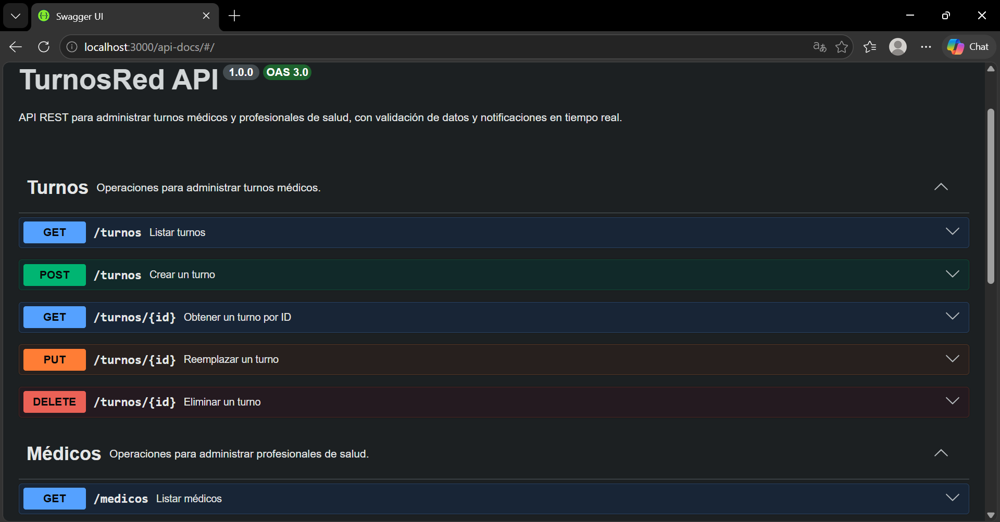
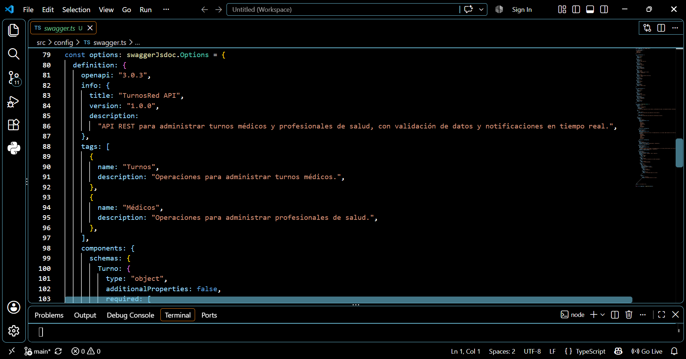
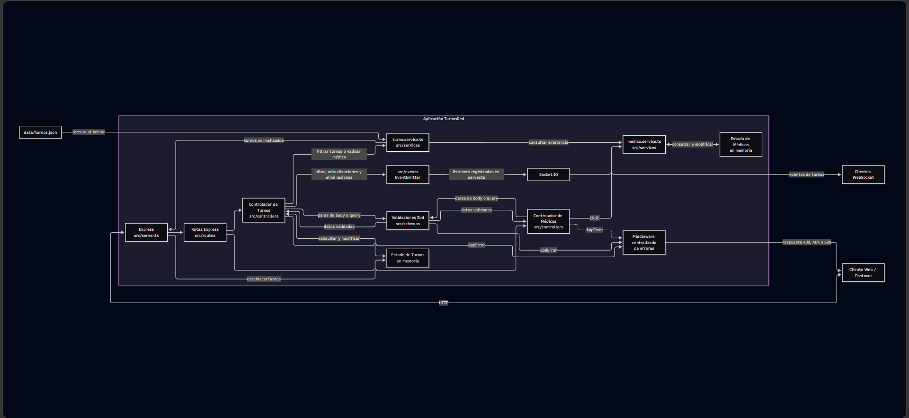
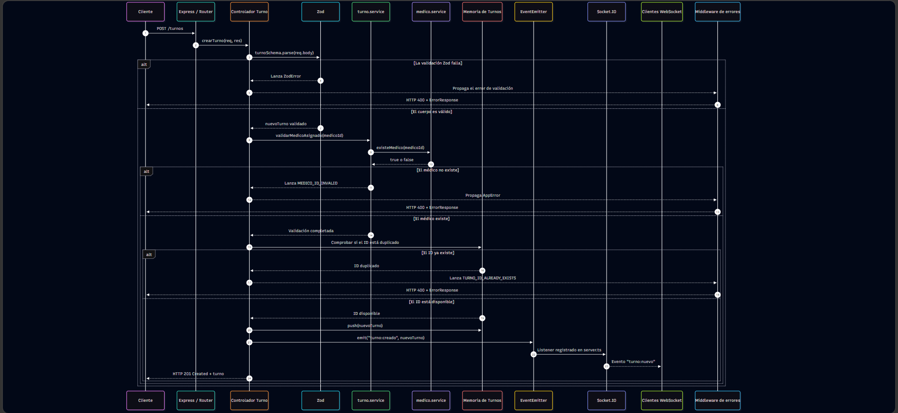
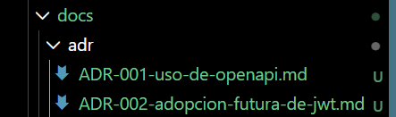

# Informe de evidencias - Actividad 3

## 1. Integración Swagger/OpenAPI

TurnosRed incorpora una especificación OpenAPI 3.0.3 generada mediante `swagger-jsdoc`. Las anotaciones se mantienen junto a las rutas Express y describen las diez operaciones de Turnos y Médicos, sus parámetros reales, cuerpos, respuestas y códigos HTTP. `swagger-ui-express` publica la documentación interactiva en `/api-docs`. La especificación no declara autenticación ni esquemas de seguridad porque el backend actual no los implementa.

### 1.1. Swagger UI en `/api-docs`

La interfaz muestra la API TurnosRed, la versión 1.0.0, OpenAPI 3.0 y las operaciones documentadas para los recursos Turnos y Médicos.

*Figura 1. Documentación interactiva de TurnosRed publicada en `/api-docs`.*

### 1.2. Fragmento de configuración Swagger

La configuración establece OpenAPI 3.0.3, la información general de la API, sus tags y el inicio de los schemas reutilizables.

*Figura 2. Fragmento real de `src/config/swagger.ts` con la definición OpenAPI.*

## 2. Arquitectura Mermaid

El README incluye un diagrama de componentes y un diagrama de secuencia para `POST /turnos`. Ambos representan la arquitectura existente: Express, rutas, controladores, validaciones Zod, servicios, estados en memoria, EventEmitter y Socket.IO. La carga desde `data/turnos.json` aparece únicamente durante el arranque y no se representa persistencia de escrituras inexistente.

### 2.1. Diagrama de componentes

*Figura 3. Componentes reales de TurnosRed y sus comunicaciones principales.*

### 2.2. Diagrama de secuencia de `POST /turnos`

*Figura 4. Validación, creación en memoria y notificación en tiempo real durante `POST /turnos`.*

## 3. Registros de decisiones arquitectónicas

`ADR-001-uso-de-openapi.md`, con estado Aceptado, establece OpenAPI como representación formal del contrato REST y documenta el uso de `swagger-jsdoc` y `swagger-ui-express`. `ADR-002-adopcion-futura-de-jwt.md`, con estado Propuesto, analiza JWT como alternativa futura sin introducir autenticación, dependencias, middlewares ni cambios en OpenAPI.

*Figura 5. Estructura real de `docs/adr` con los dos registros de decisiones arquitectónicas.*

## 4. Matriz de verificación de coherencia

| Verificación | Fuente 1 | Fuente 2 | Evidencia comprobada | Resultado | Observaciones |
| --- | --- | --- | --- | --- | --- |
| Rutas, métodos y códigos de éxito | Rutas y controladores Express | Paths y responses de OpenAPI | Las diez operaciones coinciden. GET y PUT responden 200, POST responde 201 y DELETE responde 204. | COHERENTE | No se documentaron endpoints adicionales. |
| Errores HTTP por operación | Controladores y middleware centralizado | Responses de OpenAPI | Los errores 400, 404 y 500 están declarados donde corresponden; POST y las colecciones no declaran un 404 inexistente. | COHERENTE | `ErrorResponse` se usa como respuesta común. |
| Schema Turno | `turnoSchema` de Zod | `Turno` y `TurnoActualizacion` de OpenAPI | Tipos, campos obligatorios, ausencia de nulabilidad, objeto estricto y `observaciones` opcional coinciden. | COHERENTE | PUT exige todos los campos salvo `id`, que puede omitirse. |
| Schema Médico | `medicoSchema` de Zod | `Medico` y `MedicoActualizacion` de OpenAPI | `id`, `nombre`, `especialidad` y `disponible` coinciden en tipo y obligatoriedad; PUT permite omitir únicamente `id`. | COHERENTE | Los objetos adicionales se rechazan y OpenAPI usa `additionalProperties: false`. |
| Tipos y formatos de Turno | Zod y controlador de Turnos | OpenAPI y ejemplos Postman | `documento` es string, `medicoId` es entero positivo, fecha usa `YYYY-MM-DD`, hora usa `HH:mm` y los booleanos no se convierten desde texto en el cuerpo. | COHERENTE | El caso Postman de documento numérico prueba correctamente el error 400. |
| Enum de especialidad | `especialidadSchema` | OpenAPI y Postman | Las cuatro fuentes usan exactamente Clínica médica, Pediatría, Odontología y Nutrición. | COHERENTE | Las mayúsculas y tildes forman parte del contrato HTTP. |
| Filtros de `GET /turnos` | `turnoQuerySchema` y servicio | OpenAPI y Postman | Solo se admiten `especialidad`, `fecha` y `medicoId`, y pueden combinarse. | COHERENTE | Los query parameters desconocidos producen 400 por el schema estricto. |
| Filtros de `GET /medicos` | `medicoQuerySchema` y servicio | OpenAPI y Postman | Solo se admiten `especialidad` y `disponible`; este último llega como `"true"` o `"false"` y Zod lo transforma a booleano. | COHERENTE | El texto del enunciado menciona otros filtros; se documentó el backend funcional. |
| Contrato de errores | `error.middleware.ts` | `ErrorResponse` y ejemplos Postman | `status`, `message`, `code` y `details` están siempre presentes; `details` puede estar vacío o contener objetos con `field` y `message`. | COHERENTE | Los ejemplos 400 y 404 de Postman respetan el contrato. |
| Ejemplos Swagger y Postman | Ejemplos OpenAPI y request de PUT Turno | Respuestas guardadas de Postman y backend real | Se confirmó que PUT conserva `observaciones`; la respuesta guardada de Postman se actualizó para incluir el campo enviado. | CORREGIDO | No se alteraron pruebas ni comportamiento del backend. |

## 5. Discrepancias detectadas

- El texto del enunciado menciona `especialidad`, `fecha` y `medicoId` para `GET /medicos`; la implementación funcional admite únicamente `especialidad` y `disponible`. OpenAPI y Postman conservan los filtros reales.
- La ruta implementada es `/medicos`, sin tilde. No existe una ruta alternativa `/médicos`.
- El proyecto no contiene `medicos.json`. Los médicos iniciales están definidos y se mantienen en memoria mediante `medico.service.ts`.
- `data/turnos.json` se lee durante el arranque. Las altas, actualizaciones y eliminaciones de turnos modifican el arreglo en memoria y no escriben el archivo JSON.

Estas diferencias se registran como características de la arquitectura heredada y se documenta la implementación funcional existente, sin incorporar capacidades no presentes en el sistema.

## 6. Conclusión técnica

La revisión cruzada confirma que TurnosRed mantiene una alineación sólida entre las rutas y controladores Express, las validaciones Zod, la especificación OpenAPI 3.0.3 y la colección Postman. Las diez operaciones, los códigos HTTP, los filtros, los cuerpos obligatorios y el contrato ErrorResponse coinciden con el comportamiento observado. La única desviación documental interna confirmada estaba en la respuesta guardada del PUT /turnos/:id de Postman, que omitía observaciones pese a que el request, Zod y el controlador conservaban ese campo; el ejemplo fue corregido.

Los diagramas Mermaid representan correctamente la carga inicial de data/turnos.json, el estado posterior en memoria y la propagación EventEmitter-Socket.IO. Los ADR complementan esta documentación al formalizar OpenAPI como decisión aceptada y mantener JWT como propuesta no implementada.

La revisión también evidenció diferencias entre ciertos requisitos textuales y la arquitectura heredada: /medicos no acepta fecha ni medicoId, la ruta no lleva tilde, no existe medicos.json y las altas o modificaciones de turnos no se escriben en JSON. Estas diferencias se documentaron sin atribuir al sistema capacidades inexistentes.

Para reducir drift futuro se recomienda incorporar pruebas de contrato en CI/CD: generar y validar OpenAPI, iniciar la API, ejecutar pruebas de integración que contrasten respuestas con el contrato, correr la colección mediante Newman y bloquear el pipeline ante cualquier divergencia entre código, Zod, OpenAPI o ejemplos.
